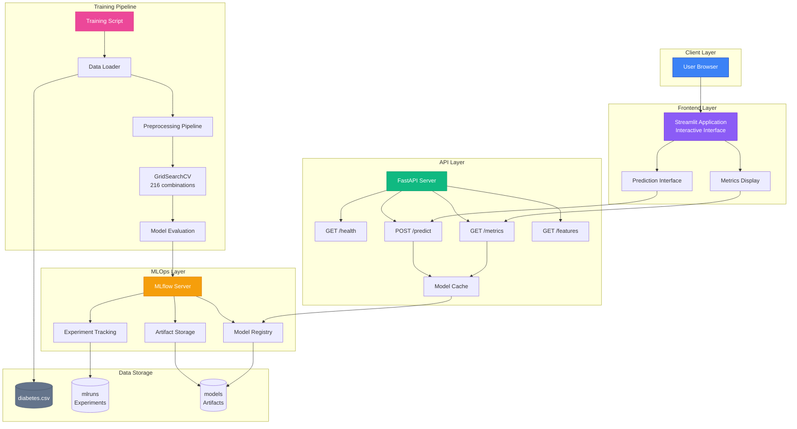

# Diabetes Prediction ML System

Machine learning application for diabetes risk prediction based on clinical indicators using the PIMA Indians Diabetes dataset. The model uses a **Gradient Boosting Classifier** optimized through GridSearchCV hyperparameter tuning.

## Architecture



## Project Structure

```
diabetes-ml/
├── training/                    # Model Training Module
│   ├── train.py                # Training script with MLflow integration
│   └── requirements.txt        # scikit-learn, mlflow, pandas, numpy
│
├── backend/                     # FastAPI Prediction Service
│   ├── main.py                 # REST API endpoints
│   └── requirements.txt        # fastapi, uvicorn, mlflow, pydantic
│
├── frontend/                    # Streamlit Dashboard
│   ├── app.py                  # Interactive web interface
│   └── requirements.txt        # streamlit, plotly, requests, pandas
│
├── data/                        # Data Storage
│   └── raw/
│       └── diabetes.csv        # PIMA Indians Diabetes dataset
│
│
├── docker-compose.yml          # Multi-service orchestration
├── README.md                   # Project documentation
```


## Technology Stack

| Layer | Technology | Purpose |
|--------|------------|----------|
| **ML Framework** | scikit-learn | Model training (Gradient Boosting) |
| **Experiment Tracking** | MLflow | Model registry, versioning, metrics |
| **Backend API** | FastAPI | RESTful prediction service |
| **Frontend Interface** | Streamlit | Interactive dashboard |
| **Visualization** | Plotly | Charts and gauges |
| **Containerization** | Docker Compose | Multi-service orchestration |
| **Runtime** | Python | Execution environment |


## Running with Docker Compose


### Start All Services
```bash
docker-compose up --build -d
```

### Train the Model

Run the training script to create and register the model:

```bash
docker-compose run --rm training
```

This will execute the training pipeline and register the model in MLflow.

### Start Services Individually

Start each service separately from the console:

**1. Start MLflow (port 5001):**
```bash
docker-compose up mlflow -d
```

**2. Start Backend (port 8000):**
```bash
docker-compose up backend -d
```

**3. Start Frontend (port 8501):**
```bash
docker-compose up frontend -d
```

### Stop All Services

Stop and remove all running containers:

```bash
docker-compose down
```

### View Service Status

Check which services are running:

```bash
docker-compose ps
```

### View Service Logs

Monitor logs for specific services:

```bash
docker-compose logs -f frontend
docker-compose logs -f backend
docker-compose logs -f mlflow
```

## Running without Docker

### Prerequisites

Make sure you have Python 3.12+ installed and create a virtual environment:

```bash
python -m venv venv
source venv/bin/activate  # On Windows: venv\Scripts\activate
```

### 1. Start MLflow Server

```bash
cd training
pip install -r requirements.txt
mlflow server --host 0.0.0.0 --port 5001 --backend-store-uri sqlite:///mlflow.db --default-artifact-root ./mlruns
```

### 2. Train the Model

Open a new terminal, activate the virtual environment and run:

```bash
cd training
export MLFLOW_TRACKING_URI=http://localhost:5001  # On Windows: set MLFLOW_TRACKING_URI=http://localhost:5001
python train.py
```

### 3. Start Backend API

Open a new terminal, activate the virtual environment and run:

```bash
cd backend
pip install -r requirements.txt
export MLFLOW_TRACKING_URI=http://localhost:5001  # On Windows: set MLFLOW_TRACKING_URI=http://localhost:5001
uvicorn main:app --host 0.0.0.0 --port 8000
```

### 4. Start Frontend Dashboard

Open a new terminal, activate the virtual environment and run:

```bash
cd frontend
pip install -r requirements.txt
export BACKEND_URL=http://localhost:8000
streamlit run app.py --server.port 8501
```

### Access the Applications

- **Frontend**: http://localhost:8501
- **Backend API**: http://localhost:8000/docs
- **MLflow UI**: http://localhost:5001


